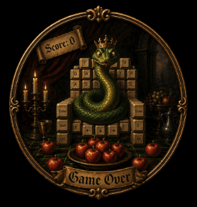
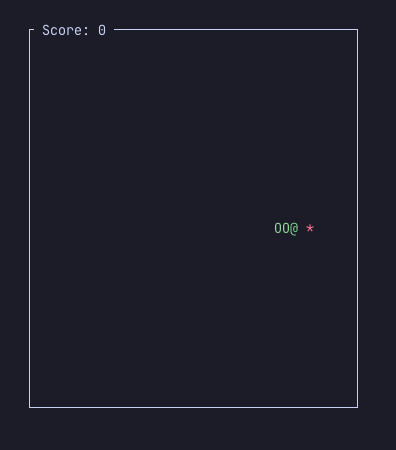

<p align="center">
  
</p>

<p align="center">
  <b>Terminal snake game built with Bevy ECS + ratatui</b>
</p>

<p align="center">
  
  
  
  
</p>

---

A classic snake game that runs entirely in your terminal. Built for developers who need a quick distraction while waiting for builds, CI, or AI responses — without leaving the terminal.

<p align="center">
  
</p>

## Features

- **Instant startup** — under 1 second from command to gameplay
- **Three control schemes** — Arrow keys, WASD, or hjkl (vim keys)
- **Progressive difficulty** — snake speeds up as your score grows (150ms → 70ms)
- **Clean architecture** — Bevy ECS separates game logic from rendering
- **Zero unsafe** — `#[forbid(unsafe_code)]` enforced project-wide
- **Strict lints** — pedantic Clippy, no `unwrap`, no `expect`, no `panic`

## Quick Start

```bash
# Play (debug build)
cargo run

# Play (release build — faster startup, optimized)
cargo run --release
```

## Controls

| Action       | Keys                          |
|:-------------|:------------------------------|
| Move up      | `↑` / `W` / `K`              |
| Move down    | `↓` / `S` / `J`              |
| Move left    | `←` / `A` / `H`              |
| Move right   | `→` / `D` / `L`              |
| Restart      | `R` (on game over screen)     |
| Quit         | `Q` / `Esc`                   |

> Pressing the opposite direction is ignored — no accidental self-collision.

## Architecture

```
┌─────────────────────────────────────────────────┐
│                   Bevy App                      │
│  ┌─────────┐  ┌──────────┐  ┌────────────────┐  │
│  │  Input  │→ │ Movement │→ │   Collision    │  │
│  │ System  │  │  System  │  │    System      │  │
│  └─────────┘  └──────────┘  └──────┬─────────┘  │
│                                    │            │
│  ┌─────────┐  ┌──────────┐  ┌──────┴─────────┐  │
│  │  Food   │← │ Scoring  │← │   Lifecycle    │  │
│  │ System  │  │  System  │  │    System      │  │
│  └─────────┘  └──────────┘  └────────────────┘  │
│                     │                           │
│              ┌──────┴──────┐                    │
│              │   Render    │ ← ratatui          │
│              │   System    │                    │
│              └─────────────┘                    │
└─────────────────────────────────────────────────┘
```

All game logic lives in pure ECS systems, completely decoupled from terminal rendering. The ratatui layer is a thin read-only view over ECS state.

## Project Structure

```
src/
├── main.rs          # App bootstrap + panic hook
├── lib.rs           # Module declarations
├── plugin.rs        # GamePlugin — wires everything into Bevy
├── components.rs    # GridPos, Direction, SnakeHead, SnakeSegment, Food
├── resources.rs     # Shared resources and event types
├── config.rs        # Grid dimensions, speed tuning constants
├── state.rs         # GameState enum (Playing / GameOver)
└── systems/
    ├── input.rs     # Keyboard handling (arrows, WASD, hjkl)
    ├── movement.rs  # Snake movement on grid tick
    ├── collision.rs # Wall + self-collision detection
    ├── food.rs      # Food spawning logic
    ├── scoring.rs   # Score tracking + speed progression
    ├── lifecycle.rs # Game reset / state transitions
    └── render.rs    # ratatui terminal rendering
```

## Requirements

- **Rust** 1.85+ (2021 edition)
- Any terminal with ANSI color support (iTerm2, Alacritty, Kitty, Ghostty, WezTerm, Terminal.app)

## License

MIT
