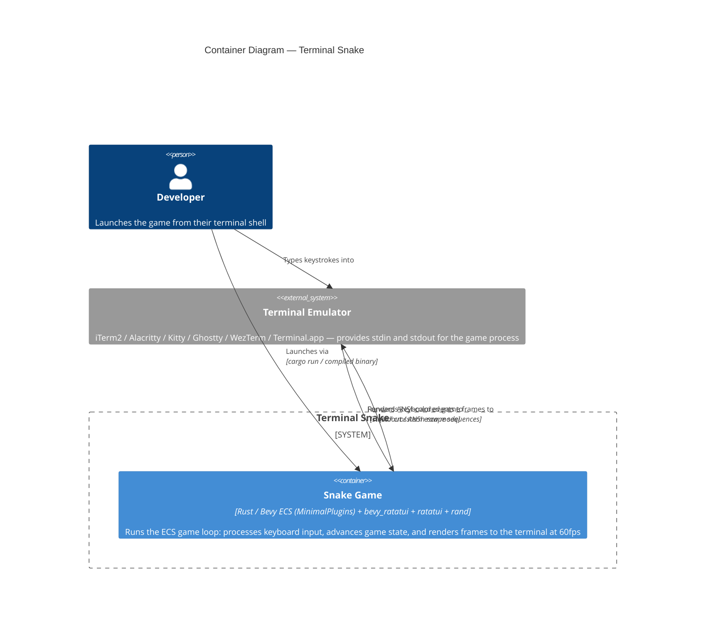

# C4 Level 2 — Container: Terminal Snake

| Level     | Status   | Author  | Created    | Last Updated |
|-----------|----------|---------|------------|--------------|
| Container | Accepted | mcuste  | 2026-04-19 | 2026-04-19   |

## Container Diagram

## Legend

- **`Container(...)`** — Deployable/runnable unit with technology label
- **`System_Ext(...)`** — External system outside the boundary

## Notes

- **Single container**: Terminal Snake is a single-process binary with no separate services, databases, or queues. All game state is in-memory for the duration of the process.
- **Technology choices**:
  - *Bevy ECS (MinimalPlugins)*: ECS runtime providing scheduler, state machine, events, and timer — GPU and windowing plugins excluded. Chosen for future graphical renderer migration (see ADR-001).
  - *bevy_ratatui*: Bridges Bevy's scheduler with ratatui's terminal lifecycle — manages raw mode, alternate screen, crossterm event forwarding, and panic-safe restoration (see ADR-002).
  - *ratatui*: Widget rendering with internal frame-diffing; only changed cells are written to stdout.
  - *rand*: Food spawn position randomisation.
- **Communication**: The game process reads from stdin via crossterm (non-blocking poll per 16ms frame) and writes to stdout via ratatui's Terminal. No IPC, no sockets, no file I/O.
- **Data ownership**: All game state (snake position, score, speed timer) lives in Bevy ECS resources and components for the process lifetime. Nothing is persisted — process exit discards all state.
- **Version pinning**: Bevy and bevy_ratatui are pinned to a mutually compatible version pair in `Cargo.toml` and updated only together (see ADR-003).

## References

- [PRD-001: Terminal Snake Game](../prd/PRD-001-terminal-snake.md)
- [RFC-001: Terminal Snake — Initial Architecture](../rfc/RFC-001-terminal-snake-architecture.md)
- [ADR-001: Bevy ECS as Game Logic Runtime](../adr/ADR-001-bevy-ecs-runtime.md)
- [ADR-002: bevy_ratatui as Terminal Rendering Bridge](../adr/ADR-002-bevy-ratatui-bridge.md)
- [ADR-003: Version Pinning Strategy](../adr/ADR-003-version-pinning-strategy.md)
- [Context Diagram](snake-context.md)
