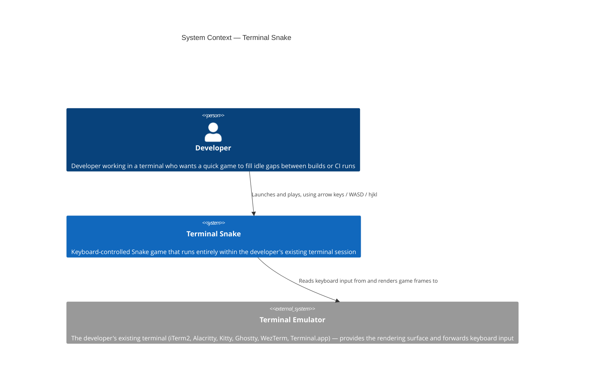

# C4 Level 1 — System Context: Terminal Snake

| Level   | Status   | Author  | Created    | Last Updated |
|---------|----------|---------|------------|--------------|
| Context | Accepted | mcuste  | 2026-04-19 | 2026-04-19   |

## System Context

## Legend

- **`Person(...)`** — Human actor or user role
- **`System(...)`** — The system being documented
- **`System_Ext(...)`** — External system outside the boundary

## Notes

- **Users/Actors**: A single developer persona covers both PRD-001 use cases (Waiting Dev and Vim-native Dev) at this level — they are the same person with the same entry point, differentiated only by preferred key scheme.
- **External dependencies**: The terminal emulator is the only external dependency. It provides stdin (keyboard events) and stdout (rendering surface). If the terminal does not support ANSI colors, rendering degrades; game logic is unaffected.
- **Trust boundaries**: No network boundary. The game binary runs in the same process space as the shell. No external services, no authentication, no persistent storage.
- **No external systems beyond the terminal**: No network APIs, no databases, no file I/O (scores are not persisted per PRD-001).

## References

- [PRD-001: Terminal Snake Game](../prd/PRD-001-terminal-snake.md)
- [RFC-001: Terminal Snake — Initial Architecture](../rfc/RFC-001-terminal-snake-architecture.md)
- [ADR-001: Bevy ECS as Game Logic Runtime](../adr/ADR-001-bevy-ecs-runtime.md)
- [ADR-002: bevy_ratatui as Terminal Rendering Bridge](../adr/ADR-002-bevy-ratatui-bridge.md)
