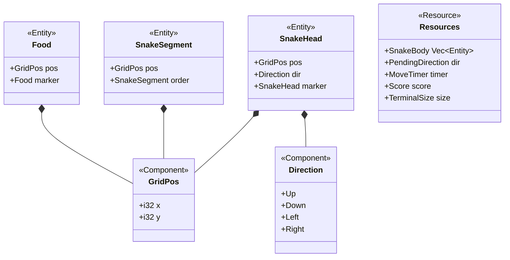
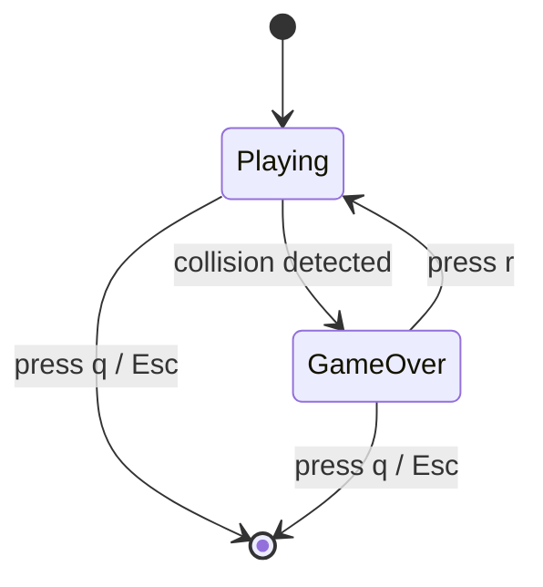
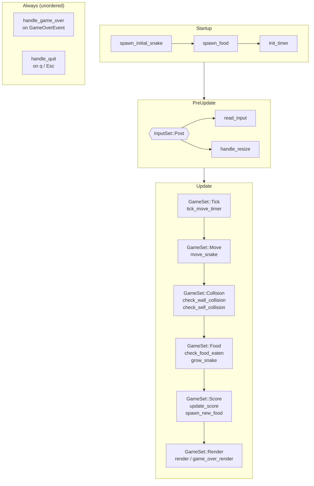

# RFC-001: Terminal Snake — Initial Architecture

**ID**: RFC-001
**Status**: Accepted
**Proposed by**: mcuste
**Created**: 2026-04-19
**Last Updated**: 2026-04-19
**Targets**: Implementation, C4, ADR

---

## Problem / Motivation

PRD-001 defines a terminal Snake game that must be built from scratch (no existing source). Three hard constraints drive every architectural decision:

1. **ECS-based architecture** — game logic must be separable from rendering to allow future migration to a Bevy graphical renderer without rewriting game systems.
2. **Terminal rendering** — must run in any modern terminal emulator with ANSI color support; no GPU, no windowing library.
3. **Instant startup** — under 1 second cold start (release build).

No prior ADRs, C4 diagrams, or RFCs exist. This RFC establishes the full architecture for the initial implementation so that development can begin without ambiguity.

---

## Goals and Non-Goals

### Goals

- Select and justify the Rust dependency stack (ECS runtime + terminal I/O bridge)
- Define the single-crate module structure
- Specify all ECS components, resources, events, and Bevy states
- Specify all systems, their responsibilities, schedule slots, and ordering constraints
- Define the input handling and direction-buffering strategy
- Define the rendering pipeline from ECS state to ratatui frame
- Define the progressive speed mechanism with easily tunable constants
- Identify implementation risks that must be resolved before coding begins

### Non-Goals

- Color palette and symbol choices — implementation detail, not architecture
- Persistent high score storage — explicitly excluded in PRD-001
- Multiplayer, sound, or mouse input — excluded in PRD-001
- Graphical rendering implementation — the architecture must *enable* future migration, not implement it
- Specific `Cargo.toml` version numbers — confirmed at implementation start against current crates.io

---

## Proposed Solution

**Stack: Bevy (MinimalPlugins) + ratatui + bevy_ratatui + rand**

`bevy_ratatui` bridges Bevy's scheduler with ratatui's terminal lifecycle. It provides: automatic raw mode entry/exit, `ScheduleRunnerPlugin` for the outer 60 fps loop, `KeyMessage` event stream from crossterm, `RatatuiContext` resource wrapping `ratatui::Terminal`, and a panic hook that restores the terminal on crash. The Bevy app uses `MinimalPlugins` — no `bevy_render`, `bevy_winit`, or GPU dependencies. `bevy_log` is excluded via feature flags (logging to stderr corrupts ratatui output; no logging requirement in PRD-001).

Pin Bevy and bevy_ratatui to mutually compatible versions at implementation time and do not update either independently thereafter. If a version mismatch arises, pin to the versions that work together rather than updating.

### Crate Layout

Single crate, no workspace.

```
snake/
  Cargo.toml
  src/
    main.rs          # App::new().add_plugins(GamePlugin).run(); panic hook
    lib.rs           # pub(crate) re-exports, AppPlugin
    config.rs        # named constants: grid size, speed curve parameters
    components.rs    # all ECS components
    resources.rs     # all ECS resources and events
    state.rs         # GameState enum
    systems/
      input.rs       # key reading, direction validation, quit/restart actions
      movement.rs    # snake advance, position cascade
      collision.rs   # wall and self-collision detection
      food.rs        # food spawning and eat detection
      scoring.rs     # score increment, speed recalculation
      render.rs      # ratatui draw system (Playing state)
      lifecycle.rs   # game reset (restart) and app exit
    plugin.rs        # GamePlugin — wires all systems, sets, states
```

All modules are `pub(crate)`. `main.rs` adds `RatatuiPlugins` and `GamePlugin` then calls `.run()`. It also installs a `std::panic::set_hook` before `.run()` to guarantee terminal restoration on panic regardless of whether `RatatuiPlugins` includes its own hook.

**`config.rs`** exposes named constants only — no structs, no traits:

```
GRID_WIDTH: i32 = 60
GRID_HEIGHT: i32 = 60
SPEED_INITIAL_MS: u64 = 150
SPEED_MIN_MS: u64 = 70
SPEED_DECREMENT_PER_FOOD: u64 = 4
```

All speed-related logic in `scoring.rs` and `resources.rs` references these constants. Tuning the speed curve requires changing one file with no cascading edits.

### ECS: Components and Entities

Three entity archetypes. `GridPos` and `Direction` are `Copy`. No `Transform` — grid position is the sole source of truth, not Bevy's spatial coordinate system.



**`SnakeBody(Vec<Entity>)`** is a resource, not derived from query order, because Bevy query iteration order is undefined. The `Vec` stores entities ordered tail-first so the cascade in `move_snake` can shift positions without a temporary buffer.

**`PendingDirection`** holds the last valid (non-opposite, non-redundant) direction received from input this frame. Overwriting a single resource with the last valid input naturally implements "last keypress wins per tick" without accumulating events.

**`MoveTimer(Timer)`** is a repeating timer. `move_snake` triggers only when `timer.just_finished()` — the timer is rebuilt (not paused) when speed changes so the new interval takes effect immediately on the next tick.

### Game State Machine



```rust
#[derive(States, Debug, Clone, Copy, PartialEq, Eq, Hash, Default)]
enum GameState { #[default] Playing, GameOver }
```

No `Menu` or `Paused` state — PRD-001 requires instant start and no menus. All game-logic systems carry `.run_if(in_state(GameState::Playing))`. `render` and `game_over_render` are mutually exclusive via the same state gating.

### System Execution Order



Systems in `GameSet::Move` through `GameSet::Score` carry `.run_if(in_state(GameState::Playing))`. `GameSet::Render` is always active but dispatches to either `render` (Playing) or `game_over_render` (GameOver) via state conditions.

The chain is declared with `.configure_sets(Update, (GameSet::Tick, GameSet::Move, GameSet::Collision, GameSet::Food, GameSet::Score, GameSet::Render).chain())`.

### Input Handling

`read_input` uses `EventReader<KeyMessage>` (bevy_ratatui's crossterm event stream), not Bevy's `ButtonInput<KeyCode>`. `KeyMessage` carries `KeyEventKind`, enabling a `KeyEventKind::Press`-only filter that normalizes Windows behavior (which emits both Press and Release per keypress).

Translation table inside `read_input`:

| crossterm key | Game action |
|---|---|
| `Up` / `Char('w')` / `Char('W')` / `Char('k')` | `Direction::Up` |
| `Down` / `Char('s')` / `Char('S')` / `Char('j')` | `Direction::Down` |
| `Left` / `Char('a')` / `Char('A')` / `Char('h')` | `Direction::Left` |
| `Right` / `Char('d')` / `Char('D')` / `Char('l')` | `Direction::Right` |
| `Char('r')` | write `PendingAction::Restart` |
| `Char('q')` / `Esc` | write `PendingAction::Quit` |

After mapping a directional key, the system queries the head's current `Direction` component. If `candidate == current.opposite()`, the input is discarded. Otherwise it overwrites `PendingDirection`. Multiple presses in one frame: last valid input wins.

### Rendering Pipeline

`ScheduleRunnerPlugin::run_loop(Duration::from_millis(16))` drives the outer loop at 60 fps. Every frame, the active render system calls `context.draw(|frame| { ... })`.

**Playing state render** (`render` system):
1. Build `[[Cell; GRID_WIDTH]; GRID_HEIGHT]` buffer — `Cell` is `Empty | Head | Body | Food`.
2. Populate from ECS queries: head `GridPos` → `Head`; each segment `GridPos` → `Body`; food `GridPos` → `Food`.
3. Implement a custom `Widget` (not `ratatui::Canvas` — that widget uses float coordinates for graph primitives, wrong for a grid game). The widget iterates the buffer row-by-row and writes `Span`s via `buf.set_string(x, y, symbol, style)`.
4. Wrap in a `Block` with `Borders::ALL` (visual wall) and title `format!("Score: {}", score.0)`.
5. Center: compute `Rect::new((cols - GRID_WIDTH - 2) / 2, (rows - GRID_HEIGHT - 2) / 2, GRID_WIDTH + 2, GRID_HEIGHT + 2)`. Clamp offsets to 0.

**Game-over overlay** (`game_over_render` system):
Renders the same stale board then overlays a centered `Clear` + `Paragraph` with `"GAME OVER\nScore: N\n\nr = restart   q = quit"`.

ratatui's `Terminal` internally diffs previous and current frame buffers — full buffer repopulation every frame is correct and efficient.

### Progressive Speed

`MoveTimer` starts at `SPEED_INITIAL_MS`. After each food eaten, `update_score` recalculates and rebuilds the timer using constants from `config.rs`:

```
interval_ms = max(SPEED_MIN_MS, SPEED_INITIAL_MS - score * SPEED_DECREMENT_PER_FOOD)
```

Default values: 150ms start, 70ms floor, −4ms per food. Score 20 hits the floor. To tune: edit `config.rs` only — no other files change. The timer is rebuilt (not mutated in place) so the new interval takes effect on the next tick.

`FixedUpdate` is not used for movement. Bevy's `FixedUpdate` timestep requires mutating `Time<Fixed>` to change speed, which is awkward and may over- or under-fire relative to `ScheduleRunnerPlugin`'s frame timing. A `Timer` in `Update` gives exactly one move per elapsed interval with no overcorrection.

---

## Alternatives

### Alternative B: Bevy ECS + crossterm (no ratatui)

Same Bevy ECS design — components, resources, systems, states, events are identical. The render system writes directly to stdout using crossterm's `queue!` / `execute!` macros and ANSI escape sequences, rather than calling `context.draw()`. `bevy_ratatui` is removed from the dependency tree.

**Rejected because:** bevy_ratatui handles terminal lifecycle concerns that are correctness-critical and non-trivial: raw mode entry/exit, alternate screen management, cursor hiding, and panic-safe restoration. Implementing these manually means writing and testing the same lifecycle code that bevy_ratatui already provides, with higher bug risk. Additionally, crossterm direct rendering without ratatui's frame-diffing requires the render system to track which cells changed to avoid flicker at 60fps — more code for the same visual result. The Bevy + ratatui stack is the fixed choice; version pinning is the mitigation for any compatibility issues, not a stack switch.

### Alternative C: hecs ECS + ratatui + crossterm

Replace Bevy with `hecs` — a minimal archetypal ECS (~5k lines) with no scheduler, no plugin system, and no state machine. Write a manual `loop { poll_input; update; render; sleep }` game loop. Use ratatui for terminal widgets, crossterm for input.

**Rejected because:** PRD-001's architecture requirement ("ECS-based — game logic must be separable from rendering for future migration to graphical mode") implies Bevy ECS specifically, given that the PRD also references `bevy_ratatui` by name and the only natural graphical target is Bevy's rendering pipeline. `hecs` entities cannot be used directly in a Bevy `App` — a migration from hecs to Bevy's graphical renderer would require porting every system and resource, not just swapping a render plugin. The ECS requirement's stated purpose (future migration) is only fulfilled if the ECS used *is* Bevy's ECS.

---

## Impact

- **Files / Modules**: All new — greenfield project. See module layout in Proposed Solution.
- **C4**: System Context and Container diagrams needed (no existing C4). To be created after RFC acceptance.
- **ADRs**: At minimum: (1) Bevy ECS as the game logic runtime; (2) bevy_ratatui as the terminal bridge; (3) version pinning strategy. To be created after RFC acceptance.
- **Breaking changes**: N/A — greenfield.

---

## Open Questions

- [x] **Stack compatibility** → **Always use Bevy + bevy_ratatui; pin to mutually compatible versions. No version updates without updating both together. No fallback to Alternative B.**
- [x] **Panic-safe terminal restoration** → **Install `std::panic::set_hook` in `main.rs` unconditionally, before `App::run()`. Belt-and-suspenders regardless of what `RatatuiPlugins` includes.**
- [x] **Tech stack selection** → **Approach A: Bevy (MinimalPlugins) + bevy_ratatui**
- [x] **Speed curve tuning** → **Constants live in `config.rs` (`SPEED_INITIAL_MS`, `SPEED_MIN_MS`, `SPEED_DECREMENT_PER_FOOD`). Tune by editing one file; no cascading changes.**
- [x] **bevy_log** → **Excluded via Bevy feature flags. No logging in the initial implementation.**

---

## Change Log

- 2026-04-19: Initial draft — Approach A selected (Bevy + bevy_ratatui)
- 2026-04-19: Open questions resolved; status → In Review
- 2026-04-19: Accepted — proceeding with ADRs, C4, implementation plan
